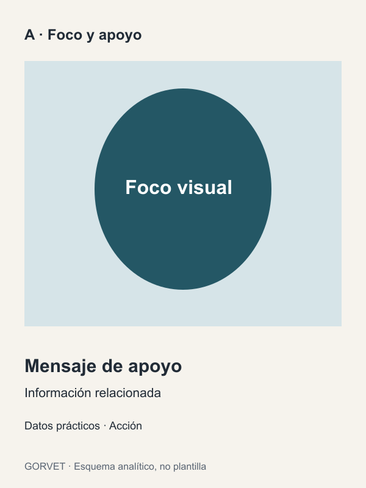
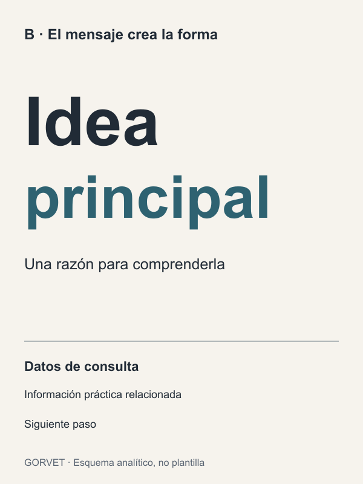
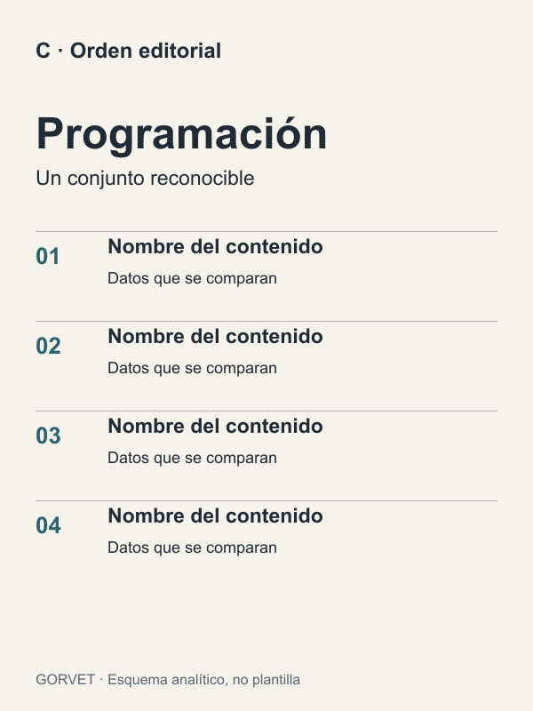
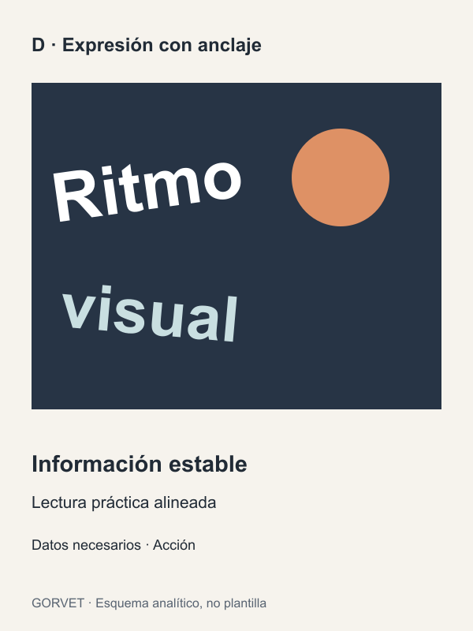

# Repertorio visual comentado

Estas fichas enseñan operaciones de diseño. Los esquemas locales son dibujos originales de Gorvet Estudios, publicados con la licencia del repositorio. Se incluyen como PNG para lectura visual y SVG editable. Son mapas de relaciones, no reproducciones de las obras citadas ni plantillas que haya que usar. Las fuentes externas permiten estudiar las obras y ampliar el repertorio cuando hay navegación; el skill funciona sin abrirlas.

## Cómo utilizar el repertorio

Elige por el problema de comunicación, no por parecido del sector. Mira foco, escala, alineación, densidad y recorrido; decide qué relación sirve a tu encargo. Adapta esa relación al copy y al soporte reales. Ninguna ficha prescribe colores, un número de bloques o una posición universal.

Si se necesita una referencia visual para una herramienta, suministra una imagen que pueda usar y explica su papel. Un enlace o una ficha Markdown no equivale a adjuntar una imagen. No copies automáticamente palabras, marcas o adornos de una referencia.

## A. Un foco y una lectura secundaria

**Mecanismo:** la masa principal capta atención; la información de apoyo ocupa otra zona con alineación estable y menor peso. El vacío diferencia funciones sin dibujar un marco para cada dato.

**Aplicación:** cuando un sujeto visual o una idea reconocible sostiene el argumento. La imagen puede cambiar de posición o dejar paso a tipografía protagonista.

**Límite:** una imagen dominante no puede borrar una condición necesaria. Los datos siguen siendo legibles; no se esconden como letra decorativa.

**Estudio externo:** [Musica Viva, 1958 — Josef Müller-Brockmann, MoMA](https://www.moma.org/collection/works/7233). Estudia la relación entre una forma gráfica protagonista y el programa tipográfico. [Descubrimiento en Pinterest](https://ru.pinterest.com/pin/1062708843336590290/); verifica la obra en la ficha del museo, no atribuyas autoría al usuario que publica el pin.

## B. El mensaje crea la forma

**Mecanismo:** la diferencia de escala y peso convierte palabras seleccionadas en forma visual. El resto conserva una estructura de consulta. El énfasis responde al significado y no se reparte por igual entre todas las palabras.

**Aplicación:** mensajes que pueden sostener la pieza sin depender de una fotografía. La caja, los saltos y la anchura construyen voz y ritmo.

**Límite:** la tipografía expresiva puede dominar el título, pero no exige volver expresivos dirección, horario y contacto. No adoptar mayúsculas o inclinaciones por imitación.

**Estudio externo:** [The Public Theater — Pentagram / Paula Scher](https://www.pentagram.com/work/the-public-theater). El estudio documenta cómo la voz gráfica responde a la institución y evoluciona entre campañas. [Selección en Pinterest](https://www.pinterest.com/pin/305048574754014366/). Extrae el vínculo entre intención y tipografía; no conviertas esa voz teatral en estilo predeterminado para cualquier anuncio.

## C. Orden para contenido denso

**Mecanismo:** un encabezado identifica el conjunto; columnas o filas repetidas permiten comparar datos del mismo tipo. Espacios y alineaciones expresan pertenencia. El contenido de igual nivel comparte tratamiento, mientras el conjunto mantiene un foco reconocible.

**Aplicación:** programación, invitaciones con información abundante o piezas de consulta. Usa la estructura que exige el contenido, no una retícula prefijada.

**Límite:** no transformar una oferta simple en una tabla ni añadir celdas vacías para rellenar el formato. La densidad puede ser necesaria; la competencia de todos los niveles no lo es.

**Estudio externo:** [The Public Theater, temporada 1995–96 — Paula Scher, MoMA](https://www.moma.org/collection/works/8840). Compara una comunicación de temporada con una comunicación de un solo acontecimiento: la información real cambia la estructura. Este esquema enseña una solución editorial propia, no reproduce ese cartel.

## D. Expresión con anclaje

**Mecanismo:** el contraste o movimiento se concentra en el argumento visual. Un área estable permite consultar los datos y evita que toda la pieza tenga el mismo ruido.

**Aplicación:** una intención expresiva justificada por público y campaña. Puede emplear collage, rotación o textura como lenguaje coherente.

**Límite:** no sumar efectos para «dar impacto». La expresión tiene que ayudar a reconocer la idea y conservar la lectura.

**Estudio externo:** [How Posters Work — Cooper Hewitt, Smithsonian Design Museum](https://www.cooperhewitt.org/exhibitions/how-posters-work/). La exposición estudia comunicación visual mediante percepción y relato; sirve para comparar estrategias distintas, no para buscar una única receta de buen cartel.

## Ampliar las referencias

Pinterest sirve para descubrir trabajos y reunir enlaces; busca la fuente del diseñador, estudio o museo para comprobar título y autoría. Mantén una selección variada de mecanismos, no veinte ejemplos del mismo acabado. En una ficha nueva registra fuente, autor conocido, mecanismo, aplicación y límite. Si no has podido observar una imagen, no inventes su análisis.

Este paquete enlaza las obras externas; no incorpora sus imágenes ni les aplica la licencia MIT del repositorio. Para referencias aportadas por el usuario, distingue material para analizar de material autorizado para redistribuir.
